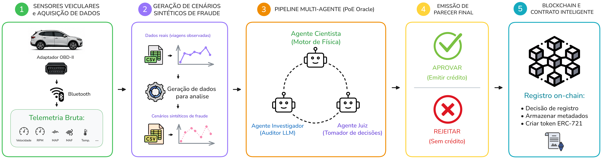
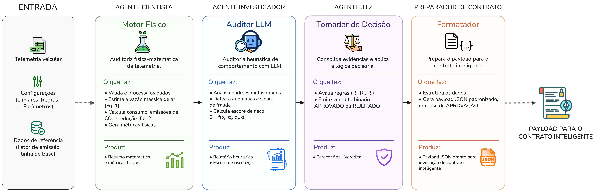
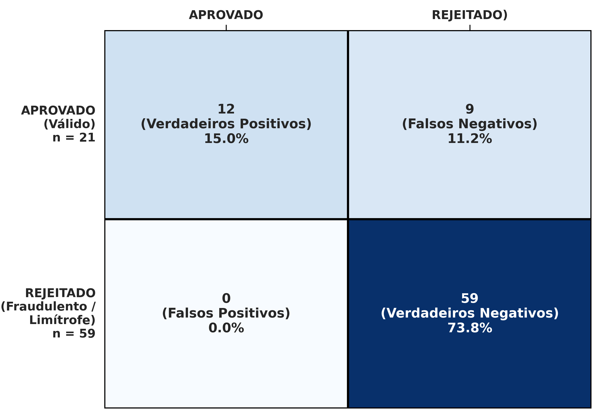

&nbsp;
&nbsp;
<p align="center">
  
</p> 
&nbsp;

# PoE-Oracle: Auditoria Inteligente na Borda para Telemetria Veicular com Arquitetura Multiagente e Validação Ciberfísica

Este repositório reúne os artefatos experimentais e a implementação de referência do estudo **PoE-Oracle (Proof-of-Eco Oracle)**, proposto para auditoria autônoma de trajetos veiculares com potencial de geração de crédito de carbono.

### Autores: [Miguel Amaral](https://github.com/MiguelEuripedes), [Marianne Silva](https://github.com/MarianneDiniz) e [Ivanovitch Silva](https://github.com/ivanovitchm)

## Resumo

Mercados de carbono aplicados à mobilidade dependem de dados *off-chain* confiáveis. O PoE-Oracle aborda esse problema por meio de uma arquitetura ciberfísica que combina telemetria OBD-II, auditoria multiagente e registro imutável em blockchain. O sistema valida consistência físico-química do consumo de combustível, detecta anomalias comportamentais e decide, de forma rastreável, se um trajeto deve ou não ser convertido em ativo digital.

## Problema e Motivação

Iniciativas de tokenização ambiental frequentemente enfrentam três limitações:

1. dificuldade em garantir autenticidade de dados coletados fora da cadeia;
2. baixa explicabilidade em decisões de aceitação/rejeição;
3. ausência de vínculo auditável entre veredito técnico e emissão do ativo.

O PoE-Oracle foi desenhado para reduzir essas lacunas com uma abordagem conservadora, orientada à minimização de fraude.

## Metodologia

A arquitetura segue um pipeline em cinco etapas:

1. **Aquisição:** captura de sinais veiculares via OBD-II (1 Hz).
2. **Estruturação:** normalização dos dados em séries temporais consistentes.
3. **Auditoria Multiagente:** validação física + investigação heurística/semântica.
4. **Veredito:** consolidação de evidências e decisão binária (aprovar/rejeitar).
5. **Registro em Blockchain:** persistência do resultado aprovado como token ERC-721.



*Figura 1 — Arquitetura geral da solução, integrando aquisição de dados, auditoria multiagente e camada blockchain.*



*Figura 2 — Fluxo interno do comitê de auditoria e encadeamento das decisões entre os agentes.*

### Comitê de Auditoria

- **Scientist Agent:** estima consumo e emissões de CO₂ por modelagem determinística.
- **Investigator Agent:** utiliza LLM local para inferir risco de manipulação (ex.: telemetria sintética, padrões incompatíveis, *spoofing*).
- **Judge Agent:** integra os pareceres e aplica a política de decisão final.
- **Contract Preparer:** serializa o resultado para invocação de contrato inteligente.

## Base Experimental

O estudo utiliza trajetos reais e cenários sintéticos de controle e fraude, totalizando **80 execuções** entre diferentes veículos e viagens.

- dados reais em `data/`;
- cenários sintéticos em `data_synthetic/`;
- saídas de avaliação em `outputs/`.

Os cenários sintéticos incluem casos de condução eficiente, falhas plausíveis de sensor e ataques explícitos (ex.: velocidade impossível, motor desligado em movimento e adulteração de temperatura).

## Resultados

| Métrica | Valor |
| :--- | :--- |
| Precisão | 1,00 (100%) |
| Falsos positivos (fraudes aceitas) | 0% |
| Acurácia global | 62,5% |
| Revocação | 0,43 |

Os resultados indicam um sistema deliberadamente conservador: a política de decisão elimina aceitação indevida de fraudes, mas sacrifica parte dos casos limítrofes com benefício ambiental marginal.



*Figura 3 — Matriz de confusão do experimento, evidenciando o perfil conservador da decisão.*


*Figura 4 — Exemplo de resultado final processado pelo pipeline para suporte à auditabilidade.*

## Contribuições

1. arquitetura multiagente explicável para validação de telemetria ambiental;
2. acoplamento entre auditoria técnica e emissão de ativo digital em blockchain;
3. corpus reproduzível com cenários reais e sintéticos para benchmarking antifraude.

## Reprodutibilidade

### Requisitos

- Python 3.10+
- Ollama com modelo `llama3:8b`
- Dependências em `requirements.txt`

### Execução

```bash
pip install -r requirements.txt
python poe_multi_agent.py
```

## Estrutura do Repositório

- `poe_multi_agent.py`: pipeline principal de auditoria multiagente.
- `contracts/CarbonCredit.sol`: contrato inteligente para emissão e registro do ativo.
- `data/` e `data_synthetic/`: conjuntos de dados do estudo.
- `outputs/`: relatórios por cenário processado.
- `figures/`: ilustrações utilizadas no material do estudo.
